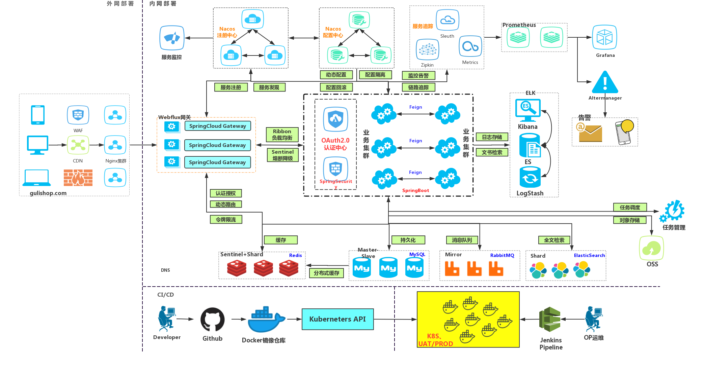
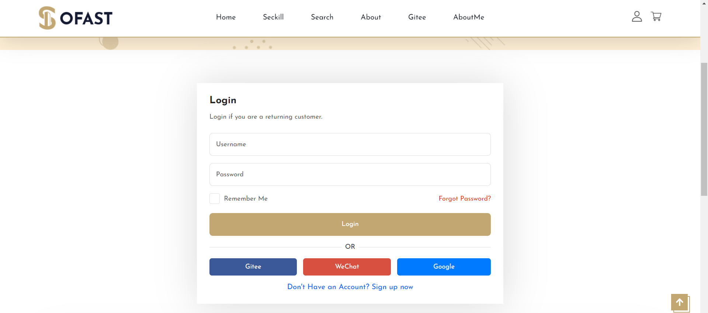
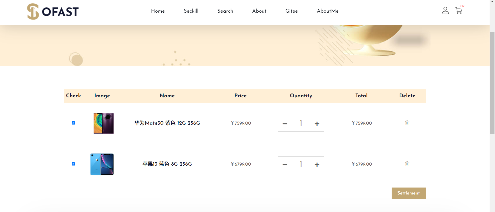
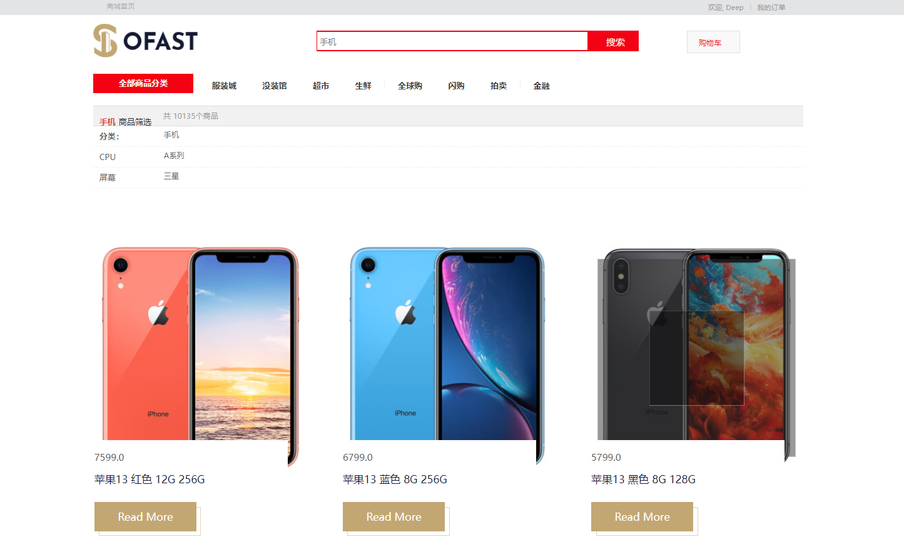
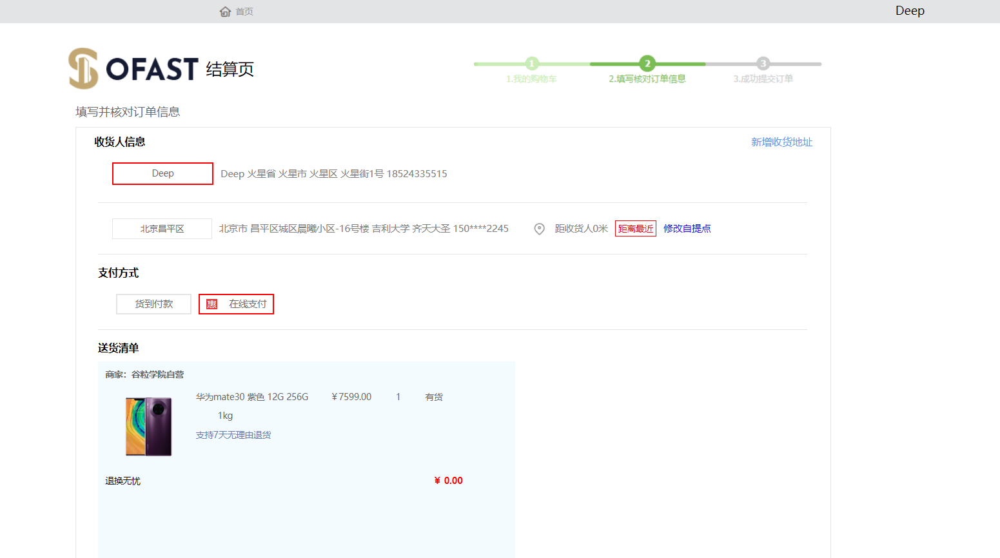
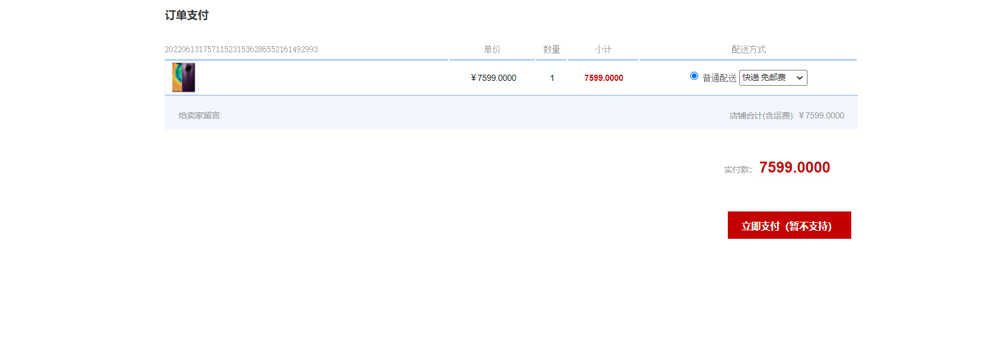

# mall-tiny

## 介绍

微服务商城，包括前台以及后台管理系统，通过将服务拆分，提供了商品服务、库存服务、订单服务、购物车服务、认证服务、秒杀服务以及网关服务。

## 技术选型

| **技术**             | **说明**           |
| -------------------- | ------------------ |
| Spring Boot          | 容器+MVC框架       |
| Spring Cloud         | 微服务框架         |
| Spring Cloud Alibaba | 微服务框架         |
| MySQL                | 数据库             |
| Redis                | 数据缓存           |
| MyBatis Plus         | 持久层框架         |
| Elasticsearch        | 搜索引擎           |
| RabbitMQ             | 消息队列           |
| Nginx                | 静态资源服务器     |
| Spring session       | 分布式session管理  |
| knife4j              | 微服务文档生成工具 |
| Maven                | 项目构建           |

## 系统架构



## 业务架构

```bash
❯ mall-tiny
├── docs            文档说明
├── mall-auth	 	认证服务
├── mall-cart	 	购物车服务
├── mall-common	 	工具类及通用代码
├── mall-coupon	 	优惠服务
├── mall-gateway 	检索服务
├── mall-order	 	订单服务
├── mall-product 	商品服务
├── mall-search	 	检索服务
├── mall-seckill	秒杀服务
├── mall-ware 		库存服务
└──  renren-fast 	后台管理服务
```

## 商品演示

### 1. 商品以及商品详情


### 2.登录演示



### 3.购物车



### 3.检索



### 4.秒杀

### 5.结算

订单确认页



订单支付页



